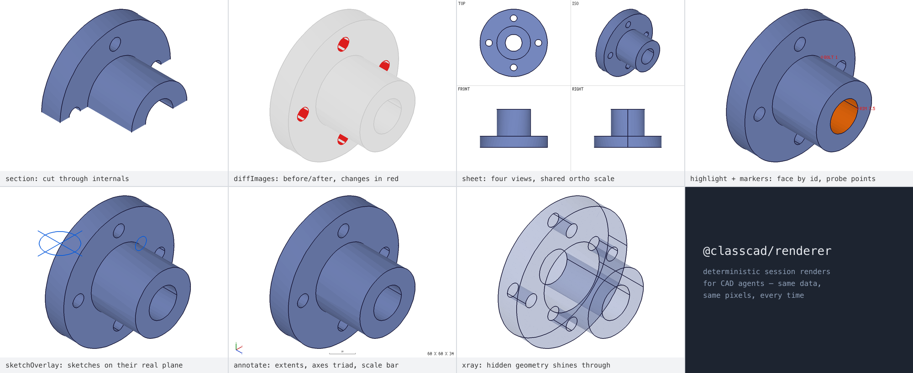

# @classcad/renderer

Renderer for [ClassCAD](https://classcad.ch)/[buerli](https://buerli.io) session
data — solids, constrained sketches, curves, and work geometry. Same input →
same image: fixed CAD views, auto-fit framing, no camera state, no GPU. Built
for agents and pipelines that need to *verify* geometry visually — not for
interactive display.



## Install

```bash
npm install @classcad/renderer          # + sharp, if you use the node adapter
```

| Entry point | Environment | Contents |
| --- | --- | --- |
| `@classcad/renderer` (= `./core`) | browser + Node, zero deps | all rendering — start with [`renderSessionData`](#rendersessiondatasource-options) |
| `./node` | Node, needs `sharp` | PNG encode/save + the file-based [`renderSession`](#rendersessionclient-prefix-outdir-options) |
| `./browser` | browser, zero deps | canvas PNG encoding |
| `./stl` | anywhere | STL parsing + legacy triangle renderer |

Every export carries TSDoc — hover any function or option field in your editor
for the same documentation as below.

## Quick start

```js
// Node (MCPs, harnesses, CI) — render a live session to PNG files
import { renderSession } from '@classcad/renderer/node'
const files = await renderSession(client, 'part', './out', { view: 'iso', annotate: true })
```

```js
// Browser (buerli-ai, custom apps) — pure data in, base64 PNG out
import { renderSessionData } from '@classcad/renderer'
import { entryToPngBase64 } from '@classcad/renderer/browser'
const entries = await renderSessionData({ tree, graphic, execute }, { view: 'front' })
const png = await entryToPngBase64(entries[0])
```

---

## API — core (`@classcad/renderer`)

### `renderSessionData(source, options?)`

`(source: SessionSource, options?: RenderOptions) => Promise<SessionEntry[]>`

Renders every visible content type from session **data** — auto-detected from
the structure tree: solids (z-buffer raster, assemblies placed via their
composed `coordinateSystem` transforms), sketches (2D SVG with dimensions,
constraint badges and label de-overlap), curves, and work geometry.

**`source` — SessionSource:**

| Field | Type | Description |
| --- | --- | --- |
| `tree` | object | structure tree (`GetTree` → `structure.tree`). Required. |
| `graphic` | object \| null | graphic payload with `containers` (recalc response or accumulated client graphic). Required for solid/curve renders. Brep **edges** are only present when the session had `v1.common.setDatabaseSettings({ isGraphicEnabled: true, isCCGraphicEnabled: true, isSketchGraphicEnabled: true, doCurveTessellation: true })`. |
| `execute` | function | optional. Harness-task executor `execute({ 'v1.sketch.getGeometry': [{ id }] }) → { result }`; enables sketch renders and `sketchOverlay`. |

**Returns** an array of entries:

| `type` | `kind` | Payload |
| --- | --- | --- |
| `'solid'` | `pixels` | `pixels` (RGBA), `width`, `height`, `frame` |
| `'sheet'` | `pixels` | same, when `options.sheet` is set |
| `'sketch'` | `svg` | `svg`, `sketchId`, `name` |
| `'curves'` / `'workgeo'` | `svg` | `svg` |

### `RenderOptions` — the complete configuration object

| Option | Type | Default | Description |
| --- | --- | --- | --- |
| `width` | number | `1600` | image width in pixels |
| `height` | number | `1200` | image height in pixels |
| `view` | CameraView | `'iso'` | named view (`iso, top, bottom, front, back, left, right`) **or** an arbitrary orthographic camera: `{ azimuth, elevation }` (degrees, Z-up turntable; 0/0 = front) or `{ direction: [x,y,z], up? }`. Named views follow CAD drawing conventions, vector cameras the photographic convention. |
| `zoom` | number | `1` | multiplier on the auto-fit scale (>1 zooms in). Ignored when `frame` is set. |
| `lookAt` | `[x,y,z]` | — | world point that lands at the image center. Ignored when `frame` is set. |
| `frame` | Frame | — | pin the frame (`{ scale, midX, midY }`) returned by an earlier render of the same view/size: fixes scale AND center so before/after renders are pixel-comparable — the precondition for [`diffImages`](#diffimagesa-b-opts). Overrides auto-fit, `zoom`, `lookAt`. |
| `colors` | `'native'` \| `'distinct'` | `'native'` | `'native'` = the model's own ClassCAD colors (face-mesh material, then container material; no material → palette fallback). `'distinct'` = one palette color per body — use to tell bodies apart in booleans, splits, patterns, assemblies of identical parts. |
| `section` | `{ origin: [x,y,z], normal: [x,y,z] }` | — | cut the solids at a plane: everything on the **positive** side of `normal` is removed. Uncapped — interior walls become visible, shaded darker. Framing stays that of the uncut model. |
| `highlight` | number[] | — | ids rendered in signal orange (faces/bodies) or signal red (edges). Matches graphic container ids, owning solid ids (`container.owner`), face mesh ids, edge ids. Unmatched ids are no-ops. |
| `markers` | `{ position: [x,y,z], label?, color? }[]` | — | probe markers: crosshair + label at world coordinates, drawn on top of everything (no depth test). |
| `sketchOverlay` | boolean | `false` | draw every sketch's curves in 3D — world coordinates, on the sketch's actual plane — over the solid render. Construction geometry dashes violet. Needs `execute`; renders standalone (on white) without solid geometry. |
| `annotate` | boolean | `false` | measurement overlay: bounding-box extents (`X x Y x Z`, model units), RGB axes triad oriented like the current view (into-screen axes omitted), scale bar with a round model-unit length. |
| `xray` | boolean | `false` | translucent bodies (painter's blend, far-to-near): hidden bodies and internal far walls shine through; edges stay opaque. |
| `xrayAlpha` | number | `0.42` | blend alpha for `xray` (0–1 exclusive). |
| `sheet` | boolean \| CameraView[4] | `false` | render the solids as ONE four-view image (quadrants TL/TR/BL/BR; `true` = top/iso/front/right). Ortho views share one scale like a technical drawing; labels use the built-in font. Entry `type` becomes `'sheet'`. |

All features compose — a sectioned x-ray sheet with markers is valid.

### `diffImages(a, b, opts?)`

`(a, b: { pixels, width, height }, opts?: { tolerance?: number }) => DiffResult`

Pixel-compares two same-size renders. Meaningful only with a **pinned frame**
(`options.frame`) — auto-fit reframes when geometry changes, which would make
every pixel "differ". Throws on size mismatch.

Returns `{ changed, total, fraction, bbox, pixels, width, height }` — `bbox`
is the changed region (or `null`), `pixels` a visualization: unchanged content
faded to gray, changed pixels red.

```js
const [before] = await renderSessionData(src, {})
// …modify the model…
const [after] = await renderSessionData(src2, { frame: before.frame })
const d = diffImages(before, after)   // d.fraction, d.bbox, d.pixels
```

### Low-level renderers

| Function | Signature | Description |
| --- | --- | --- |
| `renderSolidZBuffer` | `(graphic, width?, height?, instances?, opts?) => RasterResult \| null` | the z-buffer solid rasterizer behind `renderSessionData`. Camera from `setViewport`; `opts` is a `RenderOptions` subset plus `overlays: OverlayPolyline[]`. |
| `renderSolidSheet` | `(graphic, width?, height?, instances?, opts?) => RasterResult \| null` | the four-view sheet compositor (`opts.views` picks the quadrants). |
| `setViewport` | `({ view?, zoom?, lookAt?, frame? }) => void` | configures the camera for subsequent low-level render calls. `renderSessionData` calls it internally. |
| `renderSketchSVG` | `(items, width?, height?, dimensions?, constraints?, posMap?) => string \| null` | 2D sketch renderer (dimensions, constraint badges, label de-overlap). |
| `renderCurveSVG` | `(graphic, width?, height?) => string \| null` | tessellated 2D curve shapes. |
| `renderWorkGeoSVG` | `(workGeo, width?, height?) => string \| null` | work planes/axes/points/csys triads. |

### Data helpers

| Function | Signature | Description |
| --- | --- | --- |
| `analyzeSession` | `(tree) => { solids, sketches, curves, eifs, workGeo }` | node ids per content category (built-in planes/axes excluded). |
| `extractAssemblyInstances` | `(tree) => instances \| null` | leaf part instances with cumulative world transforms; `null` for non-assemblies. |
| `fetchSketchData` | `(execute, sketchId, tree?) => Promise<{ items, posMap } \| null>` | one sketch's geometry with WORLD-coordinate positions. |
| `sketchToOverlays` | `(items, sketchNode) => OverlayPolyline[]` | sketch geometry → 3D overlay polylines (plane normal derived from the geometry itself). |
| `extractDimensions` / `extractConstraints` | `(tree, sketchId) => …` | dimension / constraint data for the 2D sketch renderer. |
| `drawText` / `measureText` | `(pixels, w, h, x, y, text, color?, scale?)` / `(text, scale?)` | built-in 5×7 bitmap font (uppercased; deterministic). |
| `VIEW_NAMES` / `COLOR_MODES` | `string[]` | the named views / color modes. |

---

## API — node adapter (`@classcad/renderer/node`)

Re-exports the entire core, plus:

### `renderSession(client, prefix, outDir, options?)`

`(client, prefix: string, outDir: string, options?) => Promise<RenderedFile[]>`

The file-based, harness-compatible entry: ensures the graphic database
settings (so **edges** are included), fetches tree + graphic from the live
client, delegates to `renderSessionData`, encodes and writes PNGs
(`<prefix>-solid.png`, `<prefix>-sheet.png`, `<prefix>-sketch-<name>.png`, …).

**Fails loudly:** if the session contains solids/curves but no graphic data
arrived (e.g. a client connected with graphics fully disabled), it **throws**
with the cause and the remedies — never a silent empty render.

Takes all of [`RenderOptions`](#renderoptions--the-complete-configuration-object), plus:

| Option | Type | Default | Description |
| --- | --- | --- | --- |
| `recalc` | boolean | `true` | recalc before rendering for fresh graphic state. **`common.recalc` destroys entity-injection (direct-modeling) bodies** — pass `false` for `solid.*`/EIF sessions. |
| `ensureGraphics` | boolean | `true` | set the graphic database settings first (required for brep edges). |
| `source` | `'graphic'` \| `'stl'` | `'graphic'` | `'stl'` renders the tessellated **STL export** through the same z-buffer/view pipeline instead of the engine graphic — the explicit opt-in fallback for graphics-disabled clients, and an independent check of what the exported file actually contains. Never chosen automatically; marked `source: 'stl'` in the result; no brep edges. |

```js
await renderSession(client, 'detail', './out', { view: 'front', zoom: 3, lookAt: [0, 0, 25] })
await renderSession(client, 'check', './out', { source: 'stl' })   // explicit STL fallback
```

### Node helpers

| Function | Signature | Description |
| --- | --- | --- |
| `fetchGraphic` | `(client, { recalc? }?) => Promise<graphic>` | freshest graphic: recalc first (see EIF caveat above), else the client's accumulated graphic. |
| `pixelsToPng` | `(pixels, w, h) => Promise<Buffer>` | RGBA → PNG bytes (sharp). |
| `savePNG` | `(pixels, w, h, path) => Promise<void>` | RGBA → PNG file. |
| `svgToPngBuffer` | `(svg) => Promise<Buffer>` | SVG → PNG bytes. |
| `svgToPng` | `(svg, path) => Promise<void>` | SVG → PNG file. |

---

## API — browser adapter (`@classcad/renderer/browser`)

Re-exports the entire core, plus canvas-based encoding (no dependencies;
OffscreenCanvas with DOM-canvas fallback):

| Function | Signature | Description |
| --- | --- | --- |
| `entryToPngBase64` | `(entry: SessionEntry) => Promise<string>` | encode one `renderSessionData` entry (pixels or svg) as base64 PNG. |
| `pixelsToPngBase64` | `(pixels, w, h) => Promise<string>` | RGBA → base64 PNG (no `data:` prefix). |
| `svgToPngBase64` | `(svg, w?, h?) => Promise<string>` | SVG string → base64 PNG. |

---

## API — STL (`@classcad/renderer/stl`)

Renders what an **exported STL file** contains — independent of the graphic
pipeline. Useful for export verification and graphics-disabled clients (the
node adapter's `source: 'stl'` builds on this).

| Function | Signature | Description |
| --- | --- | --- |
| `parseSTL` | `(buf) => { normal, vertices }[]` | parse a binary STL buffer into triangles. |
| `renderIsometric` | `(triangles, w, h) => pixels` | legacy flat-shaded isometric render with triangle wireframe. For view/option-aware output, convert the triangles to a graphic container and use `renderSolidZBuffer`. |

---

## Notes

- **Edges need database settings.** The engine includes brep edge data in
  graphic containers only after `v1.common.setDatabaseSettings({ isGraphicEnabled:
  true, isCCGraphicEnabled: true, isSketchGraphicEnabled: true, doCurveTessellation:
  true })`. The node adapter's `renderSession` sets this automatically
  (`ensureGraphics: false` to skip); when feeding `renderSessionData` yourself,
  make sure the session had these settings before the graphic was produced.
- **Curve rendering** covers the first curve per shape container (the server
  pushes graphic data only for that one); use one shape per curve when visual
  verification matters.
